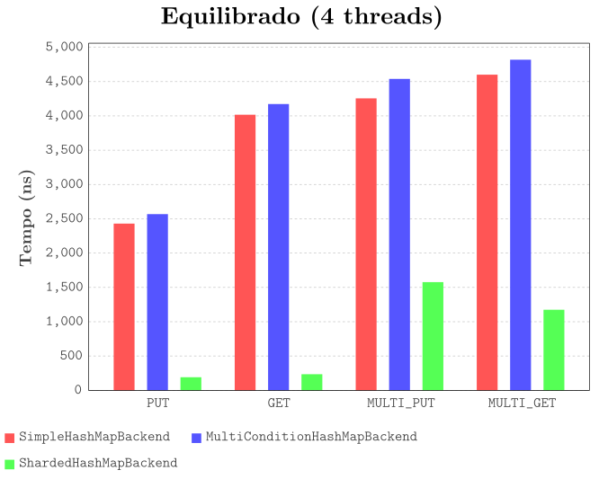

# SD

A parallel key-value database. UMinho's Distributed Systems 2024/25 assignment. See
[Assignment.pdf](Assignment.pdf) for more details.




**Grade**: 19.8 / 20.0 :star:

### Authors

 - Carolina Pereira (A100836)
 - Diogo Costa (A100751)
 - Humberto Gomes (A104348)
 - Sara Lopes (A104179)

### Building and Running

The following commands can be used to run the server, the client, and the performance tester,
respectively:

```
$ ./gradlew :server:run --args "port max_connections backend"
$ ./gradlew :client:run --args "address:port"
$ ./gradlew :tester:run --args "output_directory"
```

### Developers

Ensuring correct code formatting, which must be done before committing, is as simple as running the
following command and accepting the proposed changes:

```
$ ./format.sh
```

GitHub Actions are in place to ensure that all code in pull requests compiles and is correctly
formatted. PRs won't be accepted if actions are failing. To test them locally,
[`act`](https://github.com/nektos/act) can be used.
